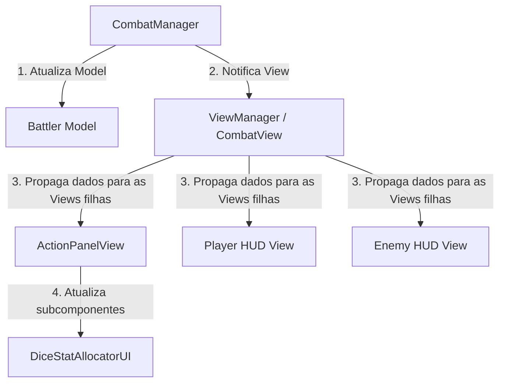

# Plano de Achatamento e Componentização da UI de CombatV2

Este plano visa reestruturar a UI do `CombatV2` para alcançar uma arquitetura mais limpa, desacoplada e achatada na hierarquia do Unity. Ele segue estritamente as regras e metas definidas em [UI_Refactor_Architect.md](file:///c:/Users/lipef/Game%20Projects/Horror%20Night/Assets/AI/Skills/UI_Refactor_Architect.md).

---

## 🚨 Relatório de Diagnóstico e Desaninhamento (Passo 2)

Nossa varredura da cena `Combat.unity` e dos prefabs de UI (especificamente `PlayerBattleUI.prefab`) revelou os seguintes problemas:

### 1. Pontos Críticos de Aninhamento (Nesting Hotspots)
*   **Painel de Alocação de Dados (Dices):** A hierarquia `BattleCanvas -> ActionsUI -> RightPanel -> AttackDefense -> Content -> PowerPanel/AccuracyPanel -> Mind/Body/Heart -> Add/Sub/Count/Icon` está extremamente aninhada (mais de 8 níveis). Reorganizar ou redimensionar essa interface é difícil porque cada botão, texto e ícone está fixado rigidamente na estrutura.
*   **HUD do Jogador:** O prefab `PlayerBattleUI.prefab` contém `HUDPanel -> HUD -> HP/Body/Mind/Heart -> fill/icon/background/count/title`, aninhando elementos visuais em até 5 níveis de profundidade.

### 2. Desalinhamento de Âncoras (Anchor Misplacements)
*   **Âncoras Vazias:** `MainCanvas`, `PlayerCanvas` e `EnemyCanvas` existem como GameObjects raiz na cena, mas estão completamente vazios e sem uso.
*   **Canvas Monolítico:** O GameObject `BattleCanvas` está atuando como um contêiner gigante e desorganizado para `ActionsUI`, `InfosUI`, `ActiveTricksUI`, `TurnUI`, `DiceRollsUI` e `PlayerBattleUI`.
*   **Vazamento do HUD do Inimigo:** O HUD do inimigo (`BattlerPanelView`) está anexado diretamente a `Characters -> EnemySpawnPoint -> EnemyBattler` no espaço do mundo (World Space) do personagem. Ele deveria residir sob a âncora `EnemyCanvas` para isolar a renderização de UI da lógica física do mundo do jogo.

### 3. Vazamentos de Responsabilidade (Responsibility Leaks)
*   **ActionPanel Monolítico:** `ActionPanelView.cs` gerencia individualmente 12 botões de alocação de dados diferentes (Adicionar/Remover para Mente, Coração, Corpo em ambos os tipos de rolagem: Poder e Precisão) e 6 textos de contagem. O script possui mais de 18 campos serializados diretos apenas para alocação de dados.
*   **Lógica na View:** O script `DiceAllocationView.cs` contém fórmulas de cálculo de dano, limites de faixas de dados (tiers) e lógica de formatação de texto (ex: `SumMin()`, `SumMax()`, `GetMultiplier()`, `GetTier()`). Essa lógica deveria residir na camada de Apresentador/Model (`CombatInputHandler` ou uma classe calculadora especializada), e não diretamente na View.
*   **Autodescoberta de Componentes:** `CombatView.cs` usa `FindObjectOfType` no método `Init()` para localizar os painéis filhos na cena. Isso torna o sistema frágil e dependente de a cena manter exatamente o mesmo layout e nomes de GameObjects.

---

## 📐 Proposta do Novo Blueprint de UI Achatada (Passo 3)

Propomos um layout reestruturado e achatado, utilizando uma abordagem de componentes reutilizáveis.

### 1. O Novo Blueprint de Canvases

Este diagrama em árvore demonstra como a hierarquia do Unity ficará estruturada sob os quatro GameObjects âncora principais:

```
Raiz da Cena (Scene Root)
├── ViewManager [CombatView] (Controlador lógico não renderizável que armazena referências para as Views)
│
├── MainCanvas (Screen Space - Overlay Canvas)
│   ├── CombatEndView [CombatEndView]
│   ├── RewardView [RewardView] (popup dinâmico)
│   ├── InventoryView [InventoryView]
│   ├── TrickInventoryView [TrickInventoryView]
│   ├── ActionPanelView [ActionPanelView] (substitui ActionsUI)
│   │   └── LeftPanel (Irmão plano na hierarquia)
│   │   └── RightPanel (Irmão plano na hierarquia)
│   ├── DiceAllocationView [DiceAllocationView] (substitui RightPanel/AttackDefense/Content)
│   ├── CombatInfoPanelView [CombatInfoPanelView] (substitui InfosUI)
│   ├── DicePanelView [DicePanelView] (substitui DiceRollsUI)
│   ├── ActionLogView [ActionLogView] (substitui ActionsLog)
│   └── TurnOrderView [FeedbackView] (substitui TurnUI)
│
├── PlayerCanvas (Screen Space - Overlay Canvas)
│   └── PlayerHUDView [BattlerPanelView] (substitui BattleCanvas/PlayerBattleUI)
│
└── EnemyCanvas (Screen Space - Overlay ou World Space Canvas)
    └── EnemyHUDView [BattlerPanelView] (extraído do GameObject do inimigo no espaço 3D)
```

### 2. Estratégia de Componentização

Extrairemos as seções repetitivas ou complexas nos seguintes componentes de UI modulares:

1.  **`DiceStatAllocatorUI` (Novo Componente):**
    *   **Propósito:** Representa uma linha de alocação de dados (Ícone, Nome do Atributo, Contador, Botão de Mais, Botão de Menos).
    *   **Código:** Expõe eventos `OnAddPressed` e `OnRemovePressed`, e um método `SetCount(int val)`.
    *   **Uso:** `ActionPanelView` terá apenas 6 referências de `DiceStatAllocatorUI` (Mente Poder, Coração Poder, Corpo Poder, Mente Precisão, Coração Precisão, Corpo Precisão) em vez de 18 campos de botões e textos avulsos.
2.  **`ResourceBarUI` (Novo Componente):**
    *   **Propósito:** Widget reutilizável que representa um recurso (HP, Mente, Coração, Corpo) com barra de preenchimento, ícone e valor textual.
    *   **Uso:** Substitui o layout duplicado e aninhado dentro de `BattlerPanelView` (HUDs de Jogador e Inimigo).

### 3. Redirecionamento do Fluxo de Dados

Em vez de as views buscarem referências na cena dinamicamente, os dados passam a fluir de forma unidirecional:



---

## 🛠️ Plano de Ação para Refatoração (Passo 4)

### Componente 1: Refatoração dos Scripts C#

Modificaremos os scripts para separar melhor as responsabilidades:
1.  **Criar [DiceStatAllocatorUI.cs](file:///c:/Users/lipef/Game%20Projects/Horror Night/Assets/Scripts/CombatV2/View/UIComponents/DiceStatAllocatorUI.cs):**
    *   Implementar bind de botões mais/menos e envio de eventos para a view pai.
2.  **Refatorar [ActionPanelView.cs](file:///c:/Users/lipef/Game%20Projects/Horror%20Night/Assets/Scripts/CombatV2/View/ActionPanelView.cs):**
    *   Substituir os campos avulsos de botões pelos novos componentes `DiceStatAllocatorUI`.
    *   Simplificar o binding de listeners e inputs.
3.  **Refatorar [DiceAllocationView.cs](file:///c:/Users/lipef/Game%20Projects/Horror%20Night/Assets/Scripts/CombatV2/View/DiceAllocationView.cs):**
    *   Remover cálculos matemáticos de dano e estimativas.
    *   Fazer com que ela apenas receba estruturas de dados limpas contendo os valores pré-calculados vindos do Presenter.

### Componente 2: Reorganização da Hierarquia do Unity

Passo a passo manual para ajustar o editor do Unity:
1.  **Mover Views para MainCanvas:** Arrastar os GameObjects `ActionsUI`, `InfosUI`, `CombatLogUI`, etc., para dentro do `MainCanvas` e renomeá-los para bater com seus respectivos scripts de View (`ActionPanelView`, `CombatInfoPanelView`, etc.).
2.  **Configurar PlayerCanvas:** Mover o GameObject do HUD do jogador (`PlayerBattleUI`) diretamente para o `PlayerCanvas`.
3.  **Configurar EnemyCanvas:** Arrastar o GameObject de HUD do inimigo (atualmente sob `Characters -> EnemySpawnPoint -> EnemyBattler`) para dentro do `EnemyCanvas`. Ajustar o modo do Canvas se for necessário mantê-lo flutuando sobre o inimigo (World Space) ou na tela (Screen Space).
4.  **Configurar referências no Inspetor do CombatView:** Em vez de usar `FindObjectOfType` em tempo de execução, arrastar as referências de todas as Views filhas diretamente no componente `CombatView` do GameObject `ViewManager`.

---

## 🧪 Plano de Verificação

### Verificação Manual
1.  Abrir a cena `Combat.unity` no Unity Editor.
2.  Rodar o jogo, entrar em combate e validar:
    *   A alocação de dados atualiza a visualização e os limites corretamente.
    *   A vida e os atributos do jogador e inimigo refletem o estado atual dos Battlers sem atrasos.
    *   Os turnos e janelas de finalização abrem e fecham sem quebras visuais.
3.  Garantir que nenhum erro de `NullReferenceException` seja exibido no Console ao rodar o `CombatView.Init()`.
