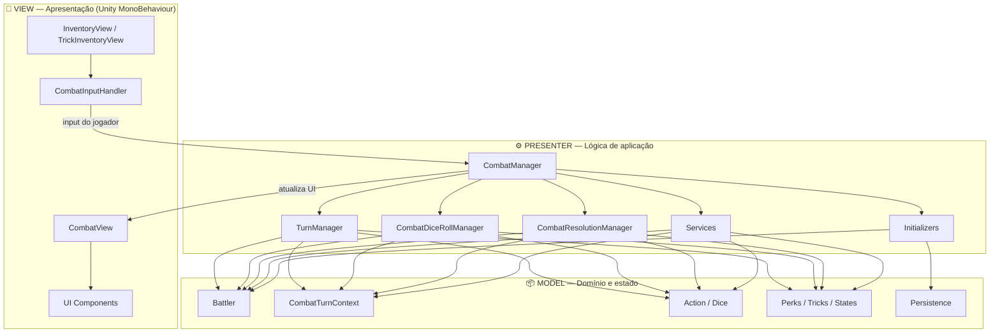
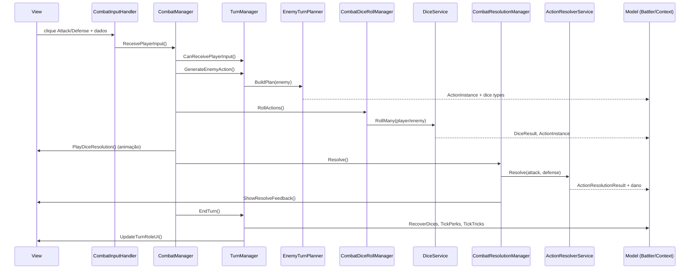
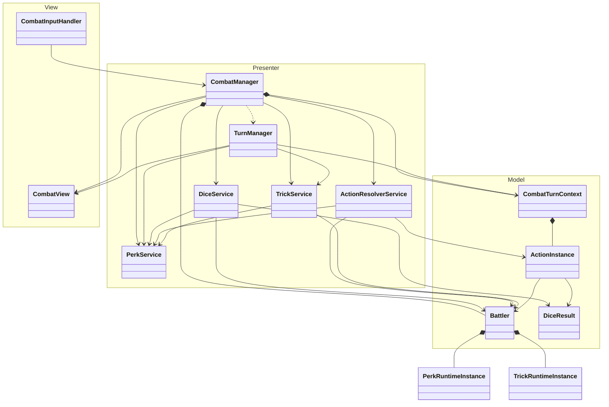

# CombatV2 — Diagrama de Classes e Arquitetura

Este documento descreve a arquitetura **MVP (Model–Presenter–View)** do sistema de combate `CombatV2`, incluindo as interações entre classes e o fluxo principal de um turno.

---

## Visão geral da arquitetura



---

## Diagrama de classes completo

```mermaid
classDiagram
    direction TB

    %% ═══════════════════════════════════════
    %% VIEW LAYER
    %% ═══════════════════════════════════════
    namespace View {
        class CombatView {
            +Init(CombatManager)
            +UpdateView(Battler, Battler)
            +PlayDiceResolution(...)
            +ShowResolveFeedback(...)
            +SetCombatInputEnabled(bool)
        }
        class CombatInputHandler {
            +Init(CombatManager)
            +OnSelectAttack()
            +OnSelectDefend()
            +OnConfirmAction()
            +OnSkipTurn()
        }
        class InventoryInputHandler {
            +Init(CombatManager, ICombatInventory)
        }
        class TrickInventoryInputHandler {
            +Init(CombatManager, ITrickInventory)
        }
        class ActionPanelView
        class BattlerHUDView
        class DiceAllocationView
        class DiceRollView
        class FeedbackView
        class CombatEndView
        class CombatLogView
        class ActiveTricksView
        class InventoryView
        class TrickInventoryView
        class PlayerFeedbacks
        class EnemyFeedbacks
        class AttackEffectFeedbacks
    }

    %% ═══════════════════════════════════════
    %% PRESENTER LAYER
    %% ═══════════════════════════════════════
    namespace Presenter {
        class CombatManager {
            -Battler Player
            -Battler Enemy
            -CombatTurnContext TurnState
            -DiceService DiceService
            -PerkService PerkService
            -TrickService TrickService
            -ActionResolverService Resolver
            +ReceivePlayerInput(...)
            +RefreshCombatUI()
        }
        class TurnManager {
            +CanReceivePlayerInput()
            +DefineStartingTurnByInitiative()
            +GenerateEnemyAction()
            +EndTurn()
            +UpdateTurnRoleUI()
        }
        class CombatDiceRollManager {
            +RollActions(...)
            +GetPlayerTierBoundaries(...)
        }
        class CombatResolutionManager {
            +Resolve(...)
            +ResolveAttackAccuracy()
            +ResolveDefenseAccuracy()
        }
        class CombatInitializer {
            +InitializeBattlers()$
        }
        class CombatInventoryInitializer {
            +BuildCombatInventory()$
            +BuildPlayerTrickInventory()$
        }
        class DiceService {
            +RollMany(...)
            +GetBestResult(...)
            +GetTierBoundaries(...)
        }
        class PerkService {
            +ApplyPerk(...)
            +GetEffectiveActionPower(...)
            +TickTurnEnd(...)
        }
        class TrickService {
            +TryCastTrick(...)
            +TickTrickEnd(...)
            +ApplyTrick(...)
        }
        class ActionResolverService {
            +Resolve(attack, defense, attacker, target)
            +CalculatePower(...)
        }
        class InitiativeResolverService {
            +ResolveStartingBattler()
        }
        class CombatEndService {
            +TryHandleCombatEnd()$
            +ProceedToGameplayScene()$
        }
        class RewardService {
            +GrantXpRewardIfEligible()
            +GetRandomLoot()
        }
        class EnemyTurnPlanner {
            +BuildPlan(...)
        }
        class EnemyActionSelector {
            +Select(...)
        }
        class EnemyVisuals {
            +SetEnemyVisual(...)
        }
        class PerkTriggerEvaluator
        class PerkEffectResolver
    }

    %% ═══════════════════════════════════════
    %% MODEL LAYER
    %% ═══════════════════════════════════════
    namespace Model {
        class Battler {
            +string Name
            +int HP, Heart, Mind, Body
            +List~PerkRuntimeInstance~ Perks
            +List~TrickRuntimeInstance~ Tricks
            +ReceiveDamage(int)
            +RecoverDices(int)
            +GetEffectivePerks()
        }
        class CombatTurnContext {
            +bool PlayerIsAttacker
            +TurnActionContext CurrentTurn
            +bool CombatEnded
            +List~DiceResult~ PendingRolls
        }
        class TurnActionContext {
            +Battler Attacker
            +Battler Defender
            +ActionInstance AttackAction
            +ActionInstance DefenseAction
        }
        class ActionInstance {
            +ActionDefinition Definition
            +DiceResult PowerDice
            +DiceResult AccuracyDice
        }
        class ActionDefinition {
            +ActionType Type
            +int BasePower
        }
        class ActionResolutionResult {
            +ActionOutcome Outcome
            +int Damage
            +ActionResolutionVariation Variation
        }
        class DiceResult {
            +int Value
            +DiceTier Tier
            +DiceStatType StatType
        }
        class CombatRollContext {
            +Battler Actor
            +Battler Opponent
            +DiceRollType RollType
        }
        class PerkRuntimeInstance {
            +PerkSO Definition
            +int Stacks
            +IsActive()
        }
        class PerkSO {
            <<ScriptableObject>>
            +string Id
            +List~PerkRule~ Rules
        }
        class PerkRule
        class TrickRuntimeInstance {
            +TrickSO Definition
            +int RemainingTurns
            +IsActive()
        }
        class TrickSO {
            <<ScriptableObject>>
            +string Id
        }
        class ITrickInventory {
            <<interface>>
            +GetSnapshot()
        }
        class TrickInventory {
            +IdentitySlots
            +CastedSlots
        }
        class ICombatInventory {
            <<interface>>
            +GetSnapshot()
        }
        class CombatInventory
        class BattlerStateRuntimeInstance
        class DrawbackRuntimeInstance
        class CombatSessionData {
            +PlayerStatusSnapshot PlayerSnapshot
            +EnemyInstance EnemyInstance
        }
        class CombatResultSnapshot
        class IEnemyActionStrategy {
            <<interface>>
        }
        class EnemyAttackActionStrategy
        class EnemyDefenseActionStrategy
    }

    %% ─── VIEW interno ───
    CombatView *-- ActionPanelView
    CombatView *-- BattlerHUDView
    CombatView *-- DiceAllocationView
    CombatView *-- DiceRollView
    CombatView *-- FeedbackView
    CombatView *-- CombatEndView
    CombatView *-- CombatLogView
    CombatView *-- ActiveTricksView
    FeedbackView *-- PlayerFeedbacks
    FeedbackView *-- EnemyFeedbacks
    FeedbackView *-- AttackEffectFeedbacks

    %% ─── VIEW → PRESENTER ───
    CombatInputHandler --> CombatManager : envia input
    InventoryInputHandler --> CombatManager
    TrickInventoryInputHandler --> CombatManager
    CombatView ..> CombatManager : referência via Init

    %% ─── PRESENTER orquestração ───
    CombatManager --> CombatView : atualiza UI
    CombatManager --> CombatInputHandler
    CombatManager *-- Battler : Player / Enemy
    CombatManager *-- CombatTurnContext : TurnState
    CombatManager --> DiceService
    CombatManager --> PerkService
    CombatManager --> TrickService
    CombatManager --> ActionResolverService
    CombatManager --> InitiativeResolverService
    CombatManager --> EnemyTurnPlanner
    CombatManager --> RewardService
    CombatManager ..> TurnManager : usa estático
    CombatManager ..> CombatDiceRollManager : usa estático
    CombatManager ..> CombatResolutionManager : usa estático
    CombatManager ..> CombatInitializer : usa estático
    CombatManager ..> CombatInventoryInitializer : usa estático
    CombatManager ..> CombatEndService : usa estático

    TurnManager --> CombatTurnContext
    TurnManager --> InitiativeResolverService
    TurnManager --> EnemyTurnPlanner
    TurnManager --> PerkService
    TurnManager --> TrickService
    TurnManager --> CombatView
    TurnManager --> CombatInputHandler

    CombatDiceRollManager --> DiceService
    CombatDiceRollManager --> PerkService
    CombatDiceRollManager --> CombatTurnContext
    CombatDiceRollManager --> Battler
    CombatDiceRollManager --> ActionInstance

    CombatResolutionManager --> ActionResolverService
    CombatResolutionManager --> CombatView
    CombatResolutionManager --> CombatTurnContext
    CombatResolutionManager --> Battler

    CombatInitializer --> Battler
    CombatInitializer --> CombatSessionData
    CombatInitializer --> EnemyVisuals

    CombatInventoryInitializer --> ICombatInventory
    CombatInventoryInitializer --> ITrickInventory
    CombatInventoryInitializer --> TrickService
    CombatInventoryInitializer --> Battler

    %% ─── Services ───
    DiceService --> PerkService
    DiceService --> DiceResult
    DiceService --> Battler
    DiceService --> CombatRollContext

    PerkService --> PerkTriggerEvaluator
    PerkService --> PerkEffectResolver
    PerkService --> PerkSO
    PerkService --> PerkRuntimeInstance
    PerkService --> Battler
    PerkService --> BattlerStateRuntimeInstance
    PerkService --> DrawbackRuntimeInstance

    TrickService --> PerkService
    TrickService --> TrickRuntimeInstance
    TrickService --> ITrickInventory
    TrickService --> Battler

    ActionResolverService --> PerkService
    ActionResolverService --> ActionInstance
    ActionResolverService --> ActionResolutionResult
    ActionResolverService --> Battler

    EnemyTurnPlanner --> EnemyActionSelector
    EnemyTurnPlanner --> ActionInstance
    EnemyTurnPlanner --> Battler

    EnemyActionSelector --> IEnemyActionStrategy
    EnemyAttackActionStrategy ..|> IEnemyActionStrategy
    EnemyDefenseActionStrategy ..|> IEnemyActionStrategy
    EnemyActionSelector --> ActionInstance

    CombatEndService --> CombatView
    CombatEndService --> RewardService
    CombatEndService --> CombatTurnContext
    CombatEndService --> CombatResultSnapshot
    CombatEndService --> Battler

    %% ─── MODEL interno ───
    CombatTurnContext *-- TurnActionContext
    TurnActionContext --> ActionInstance
    TurnActionContext --> Battler
    ActionInstance --> ActionDefinition
    ActionInstance --> DiceResult
    Battler *-- PerkRuntimeInstance
    Battler *-- TrickRuntimeInstance
    Battler *-- BattlerStateRuntimeInstance
    Battler *-- DrawbackRuntimeInstance
    PerkRuntimeInstance --> PerkSO
    PerkSO *-- PerkRule
    TrickRuntimeInstance --> TrickSO
    TrickInventory ..|> ITrickInventory
    CombatInventory ..|> ICombatInventory
    CombatSessionData ..> CombatResultSnapshot : gera ao fim
```



---

## Fluxo principal de interação (turno do jogador)



---

## Diagrama simplificado (classes centrais)

> Versão visual exportada em: [`ARCHITECTURE-simplified.png`](./ARCHITECTURE-simplified.png)



---

## Resumo por camada

| Camada | Responsabilidade | Classes principais |
|--------|------------------|--------------------|
| **Model** | Estado, regras de domínio, dados persistentes | `Battler`, `CombatTurnContext`, `ActionInstance`, `DiceResult`, `PerkRuntimeInstance`, `TrickRuntimeInstance`, `CombatSessionData` |
| **Presenter** | Orquestração, serviços, fluxo de turno | `CombatManager`, `TurnManager`, `DiceService`, `PerkService`, `TrickService`, `ActionResolverService`, `CombatDiceRollManager`, `CombatResolutionManager` |
| **View** | UI Unity, feedback visual, input do usuário | `CombatView`, `CombatInputHandler`, `ActionPanelView`, `FeedbackView`, `DiceRollView`, `*Feedbacks`, `*UI` |

---

## Estrutura de pastas

```
CombatV2/
├── Model/
│   ├── Action/           # ActionDefinition, ActionInstance, ActionResolutionResult, AI strategies
│   ├── Battler/          # Battler
│   ├── Context/          # CombatTurnContext, TurnActionContext, perk conditions
│   ├── Dice/             # DiceResult, enums
│   ├── Drawbacks/        # DrawbackSO, DrawbackRuntimeInstance, DrawbackDatabase
│   ├── Item/             # EquippedItemInstance
│   ├── Perks/            # PerkSO, PerkRuntimeInstance, PerkRule, evaluators
│   ├── Persistence/      # CombatSessionData, CombatInventory, snapshots
│   ├── States/           # BattlerStateSO, BattlerStateRuntimeInstance
│   └── Tricks/           # TrickSO, TrickInventory, TrickRuntimeInstance
├── Presenter/
│   ├── InputHandler/     # CombatInputHandler, InventoryInputHandler, TrickInventoryInputHandler
│   ├── Service/
│   │   ├── AiService/    # EnemyTurnPlanner, EnemyActionSelector, EnemyVisuals
│   │   ├── Dice/         # DiceService
│   │   ├── Perk/         # PerkService, PerkEffectResolver, PerkTriggerEvaluator
│   │   ├── Resolver/     # ActionResolverService, CombatEndService, InitiativeResolverService
│   │   ├── Reward/       # RewardService
│   │   └── Trick/        # TrickService
│   ├── CombatManager.cs
│   ├── CombatInitializer.cs
│   ├── CombatInventoryInitializer.cs
│   ├── CombatDiceRollManager.cs
│   ├── CombatResolutionManager.cs
│   └── TurnManager.cs
└── View/
    ├── Feedbacks/        # PlayerFeedbacks, EnemyFeedbacks, AttackEffectFeedbacks, StatusEffectFeedbacks
    ├── UIComponents/     # Dice, Trick, Item, StatusEffect, CombatLog UI
    ├── CombatView.cs
    ├── ActionPanelView.cs
    ├── BattlerHUDView.cs
    ├── DiceAllocationView.cs
    ├── DiceRollView.cs
    ├── FeedbackView.cs
    ├── CombatEndView.cs
    ├── InventoryView.cs
    └── TrickInventoryView.cs
```

---

## Padrões arquiteturais

1. **Facade na View** — `CombatView` agrega todas as sub-views e expõe uma API simples ao `CombatManager`.
2. **Services no Presenter** — lógica de negócio (`DiceService`, `PerkService`, `ActionResolverService`) fica fora dos MonoBehaviours.
3. **State object** — `CombatTurnContext` concentra o estado transitório do combate (turno, rolagens pendentes, fim de combate).
4. **Dependency injection manual** — serviços são instanciados no `Start()` do `CombatManager`:
   - `PerkService` → `TrickService` → `DiceService` → `ActionResolverService`
5. **ScriptableObjects no Model** — definições estáticas (`PerkSO`, `TrickSO`, `BattlerStateSO`) separadas de instâncias runtime (`*RuntimeInstance`).
6. **Static managers** — `TurnManager`, `CombatDiceRollManager`, `CombatResolutionManager` e `CombatEndService` são classes estáticas auxiliares ao `CombatManager`.

---

## Dependências entre serviços

```
PerkService (base)
    ├── TrickService
    ├── DiceService
    └── ActionResolverService

InitiativeResolverService (independente)
EnemyTurnPlanner → EnemyActionSelector → IEnemyActionStrategy
RewardService (independente)
CombatEndService → RewardService, CombatView
```
